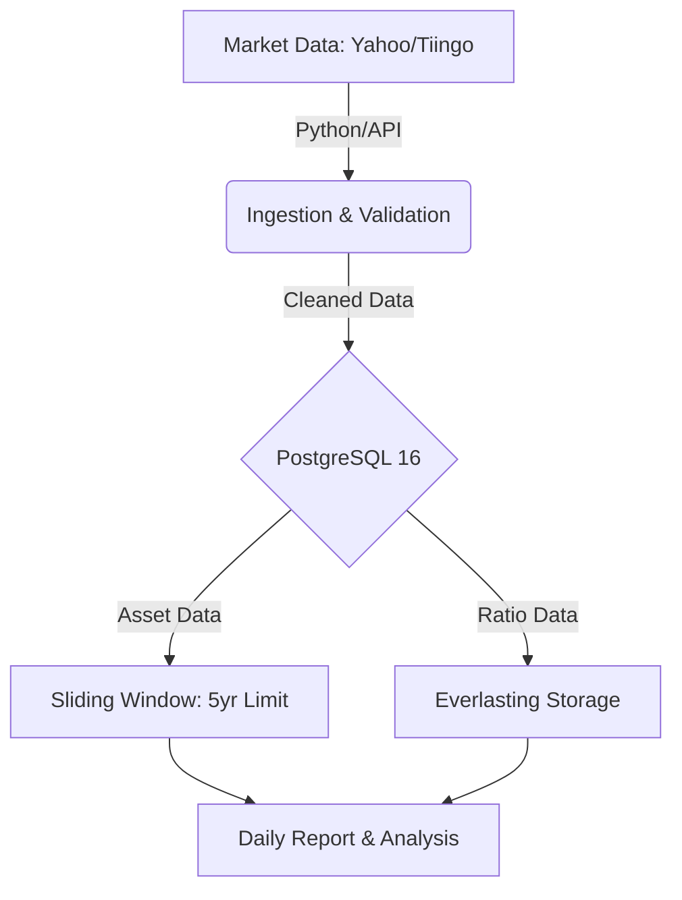

# Project Alpha: Financial Database Architecture

## 1. Overview
An institutional-grade time-series database designed for cross-asset investment and risk management.

## 2. System Flow

## 3. Database Schema
### Asset Tables (Stocks, FX, Commodities, Bonds)
- `ticker` (PK, Index)
- `date` (PK, Index)
- `adj_close` (Numeric)
- `volume` (BigInt, On-Demand)

### Equity Options Table
- `ticker` / `strike` / `type` / `expiry` (Indices)
- `close_price`
- `auto_cleanup_flag` (True after expiry)

### Intermarket Ratio Table
- `num_ticker` / `den_ticker`
- `ratio_value`
- `date` (No cleanup logic)

## 4. Maintenance Logic
- **Weekly Cron:** `DELETE FROM asset_tables WHERE date < NOW() - INTERVAL '5 years'`
- **Daily Cron:** `DELETE FROM options_table WHERE expiry < NOW()`
